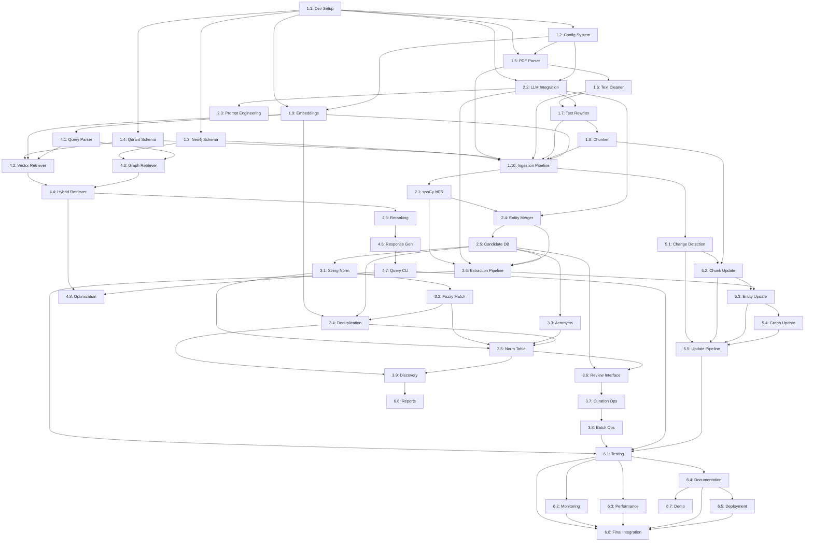

# Graph RAG System - Developer Task Breakdown

## Overview

This document breaks down the implementation of the Graph RAG system into specific, actionable tasks for a senior software developer. Each task is designed to be independently completable with clear deliverables and acceptance criteria.

**Project Timeline:** 10 weeks
**Architecture Reference:** [`graph-rag-architecture.md`](graph-rag-architecture.md)

---

## Phase 1: Foundation (Weeks 1-2)

### Task 1.1: Development Environment Setup
**Priority:** Critical
**Dependencies:** None

**Description:**
Set up the complete development environment including databases, LLM infrastructure, and project structure.

**Steps:**
1. Create Docker Compose configuration for Neo4j and Qdrant
2. (Skip as already installed) Install and configure Ollama with Llama 3.1 model
3. Set up Python virtual environment with required dependencies
4. Create project directory structure as specified in architecture
5. Initialize Git repository with appropriate `.gitignore`
6. Create `.env.example` with all required environment variables

**Deliverables:**
- [`docker-compose.yml`] with Neo4j and Qdrant services
- [`pyproject.toml`] with all dependencies listed
- Complete project directory structure
- [`.env.example`] template file
- [`README.md`] with setup instructions

**Acceptance Criteria:**
- Neo4j accessible at localhost:7474 with authentication
- Qdrant accessible at localhost:6333
- Ollama running and responding to test prompts
- All dependencies installable via pip
- Project structure matches architecture document

---

### Task 1.2: Configuration Management System
**Priority:** High
**Dependencies:** Task 1.1

**Description:**
Implement centralized configuration management using Pydantic for validation and environment variables.

**Steps:**
1. Create [`src/utils/config.py`] with Pydantic models for configuration
2. Implement config loader that reads from YAML and environment variables
3. Create [`config/config.yaml`] with default values
4. Add configuration validation on startup
5. Implement configuration override mechanism for testing

**Deliverables:**
- [`src/utils/config.py`] with `Config` class
- [`config/config.yaml`] with all configuration sections
- Unit tests for configuration loading and validation

**Acceptance Criteria:**
- Configuration loads from YAML file
- Environment variables override YAML values
- Invalid configurations raise descriptive errors
- All sections from architecture are represented

---

### Task 1.3: Database Schema Implementation - Neo4j
**Priority:** Critical
**Dependencies:** Task 1.1

**Description:**
Create Neo4j graph database schema including node labels, relationship types, properties, and indexes.

**Steps:**
1. Create [`src/storage/schemas.py`] with Pydantic models for all entity types
2. Create [`scripts/setup_databases.py`] script for database initialization
3. Implement Cypher queries to create constraints and indexes
4. Define node labels for all entity types (System, Subsystem, Component, etc.)
5. Define relationship types with properties
6. Create utility functions for schema validation

**Deliverables:**
- [`src/storage/schemas.py`] with data models
- [`scripts/setup_databases.py`] initialization script
- [`src/storage/neo4j_manager.py`] with connection and basic CRUD operations
- Documentation of schema in docstrings

**Acceptance Criteria:**
- All node labels created with required properties
- All relationship types defined
- Indexes created on: [`canonical_name`], [`entity_type`], [`id`]
- Full-text search index created for entities
- Script can be run multiple times idempotently

---

### Task 1.4: Database Schema Implementation - Qdrant
**Priority:** Critical
**Dependencies:** Task 1.1

**Description:**
Set up Qdrant vector database collections for chunks and entities with appropriate configurations.

**Steps:**
1. Create [`src/storage/qdrant_manager.py`] with Qdrant client wrapper
2. Implement collection creation for [`document_chunks`] and [`entities`]
3. Define payload schemas with proper indexing
4. Configure HNSW parameters for optimal performance
5. Implement vector upsert and search operations
6. Add health check and collection info methods

**Deliverables:**
- [`src/storage/qdrant_manager.py`] with `QdrantManager` class
- Collection initialization in [`scripts/setup_databases.py`]
- Payload schema definitions
- Basic search and upsert methods

**Acceptance Criteria:**
- Two collections created: [`document_chunks`] and [`entities`]
- Proper vector dimensions configured (768 for BGE embeddings)
- Payload indexes on: [`document_id`], [`entity_ids`], [`entity_type`]
- Cosine similarity as distance metric
- Connection pooling implemented

---

### Task 1.5: PDF Parsing with Docling
**Priority:** High
**Dependencies:** Task 1.1, Task 1.2

**Description:**
Implement PDF parsing using Docling with OCR support, extracting text, structure, and metadata.

**Steps:**
1. Create [`src/ingestion/pdf_parser.py`] with `PDFParser` class
2. Implement Docling integration with OCR enabled
3. Extract document structure (sections, subsections, paragraphs)
4. Extract metadata (title, date, version, page count)
5. Handle tables and figures separately
6. Implement error handling for corrupt/malformed PDFs
7. Add progress logging for large documents

**Deliverables:**
- [`src/ingestion/pdf_parser.py`] with parsing logic
- [`src/ingestion/metadata_extractor.py`] for metadata extraction
- Test suite with sample PDFs
- Parsed document data structure (JSON schema)

**Acceptance Criteria:**
- Parses PDFs with and without OCR
- Preserves document hierarchy and structure
- Extracts metadata accurately
- Handles multi-column layouts
- Returns structured output matching schema
- Graceful error handling with informative messages

---

### Task 1.6: Text Cleaning and Preprocessing
**Priority:** High
**Dependencies:** Task 1.5

**Description:**
Implement text cleaning module to remove noise, headers, footers, and other unwanted content using regex patterns.

**Steps:**
1. Create [`src/ingestion/text_cleaner.py`] with `TextCleaner` class
2. Implement regex-based pattern matching for common noise
3. Create pattern categories: headers, footers, page_numbers, watermarks, OCR errors
4. Implement whitespace normalization
5. Add preservation logic for code blocks and equations
6. Create [`config/cleaning_patterns.yaml`] with default patterns
7. Add pattern enable/disable configuration
8. Implement custom pattern support

**Deliverables:**
- [`src/ingestion/text_cleaner.py`] with cleaning logic
- [`config/cleaning_patterns.yaml`] with regex patterns
- Configuration integration in [`config/config.yaml`]
- Unit tests with various noise scenarios

**Acceptance Criteria:**
- Removes headers and footers accurately
- Strips page numbers and metadata
- Preserves technical content (code, equations)
- Configurable patterns per document type
- Fast processing (>10 pages/second)
- Handles edge cases without data loss
- Whitelist patterns protect important content

---

### Task 1.7: Optional LLM Text Rewriting
**Priority:** Medium
**Dependencies:** Task 1.6, Task 2.2

**Description:**
Implement optional LLM-based text rewriting to improve readability and parsing while preserving information.

**Steps:**
1. Create [`src/ingestion/text_rewriter.py`] with `TextRewriter` class
2. Implement separate LLM integration for text rewriting (can use different provider/model)
3. Add configuration for rewriting-specific LLM provider and model
4. Create rewriting prompt template in [`config/rewriting_prompt.yaml`]
5. Implement chunk-level rewriting (section/subsection)
6. Add preservation checks for technical terms and numbers
7. Implement original text preservation for comparison
8. Add quality validation (ensure information preserved)
9. Create enable/disable configuration
10. Add selective document targeting

**Deliverables:**
- [`src/ingestion/text_rewriter.py`] with rewriting logic
- [`config/rewriting_prompt.yaml`] with prompt template
- Configuration for enabling/disabling feature
- Comparison report showing original vs. rewritten
- Quality validation checks

**Acceptance Criteria:**
- Preserves all technical terms and numbers
- Maintains relationships between concepts
- Improves readability demonstrably
- Optional feature (disabled by default)
- Uses separate LLM configuration (provider and model)
- Can use different LLM than extraction pipeline
- Processing time acceptable (<10s per section)
- Can be applied selectively to documents
- Original text preserved for audit

---

### Task 1.8: Hierarchical Chunking Implementation
**Priority:** High
**Dependencies:** Task 1.7

**Description:**
Implement hierarchical document chunking strategy with four levels: document, section, subsection, paragraph.

**Steps:**
1. Create [`src/ingestion/chunker.py`] with `HierarchicalChunker` class
2. Implement level 1 (document) chunking with full metadata
3. Implement level 2 (section) chunking based on document structure
4. Implement level 3 (subsection) chunking
5. Implement level 4 (paragraph) chunking with token limits
6. Maintain parent-child relationships between chunks
7. Add hierarchy path tracking (e.g., "1.2.3")
8. Implement token counting and size limits

**Deliverables:**
- [`src/ingestion/chunker.py`] with chunking logic
- Chunk data structure with all required fields
- Test suite with various document structures
- Configuration for chunk sizes and overlap

**Acceptance Criteria:**
- Generates chunks at all four hierarchy levels
- Parent-child relationships correctly maintained
- Each chunk has unique ID and references parent
- Token counts accurate for each chunk
- Configurable chunk sizes and overlap
- Preserves page number references

---

### Task 1.9: Embedding Generation
**Priority:** High
**Dependencies:** Task 1.1, Task 1.2

**Description:**
Implement embedding generation for document chunks and entities using FastEmbed or Sentence Transformers.

**Steps:**
1. Create [`src/utils/embeddings.py`] with `EmbeddingGenerator` class
2. Integrate FastEmbed or Sentence Transformers
3. Implement batched embedding generation for efficiency
4. Add caching mechanism for embeddings
5. Handle long text truncation
6. Implement retry logic for API-based embeddings (optional)
7. Add embedding normalization if needed

**Deliverables:**
- [`src/utils/embeddings.py`] with embedding generation
- Support for multiple embedding models via configuration
- Batch processing with configurable batch size
- Error handling and logging

**Acceptance Criteria:**
- Generates 768-dimensional embeddings (BGE model)
- Batched processing for efficiency
- Consistent embeddings for same input
- Handles text longer than model max length
- Configurable model selection
- Performance: >100 embeddings/second

---

### Task 1.10: Basic Ingestion Pipeline
**Priority:** High
**Dependencies:** Task 1.3, Task 1.4, Task 1.5, Task 1.6, Task 1.7, Task 1.8, Task 1.9

**Description:**
Create end-to-end ingestion pipeline that processes PDFs and stores chunks in both databases.

**Steps:**
1. Create [`src/pipeline/ingestion_pipeline.py`] with `IngestionPipeline` class
2. Implement pipeline orchestration: parse → chunk → embed → store
3. Add document tracking and status management
4. Implement batch processing for multiple documents
5. Add progress tracking and logging
6. Store chunks in Qdrant with embeddings
7. Store document metadata and chunk references in Neo4j
8. Add error handling and rollback mechanism

**Deliverables:**
- [`src/pipeline/ingestion_pipeline.py`] with complete pipeline
- [`scripts/ingest_documents.py`] CLI script for batch ingestion
- Document status tracking in both databases
- Comprehensive logging

**Acceptance Criteria:**
- Processes single PDF end-to-end successfully
- Batches multiple PDFs efficiently
- Stores all chunks in Qdrant with embeddings
- Creates document and chunk nodes in Neo4j
- Handles failures gracefully with rollback
- Provides progress feedback
- Can resume interrupted ingestion

---

## Phase 2: Entity Extraction (Weeks 3-4)

### Task 2.1: spaCy NER Pipeline Setup
**Priority:** High
**Dependencies:** Task 1.10

**Description:**
Set up spaCy NER pipeline with domain-specific patterns for satellite terminology.

**Steps:**
1. Create [`src/extraction/spacy_extractor.py`] with `SpacyExtractor` class
2. Load transformer-based English model (`en_core_web_trf`)
3. Create custom entity patterns for satellite domain
4. Add custom pipeline component for domain terms
5. Implement entity extraction from chunks
6. Add confidence scoring based on context
7. Store patterns in [`config/entity_patterns.jsonl`]

**Deliverables:**
- [`src/extraction/spacy_extractor.py`] with extraction logic
- [`config/entity_patterns.jsonl`] with domain patterns
- Entity extraction returning structured format
- Confidence scoring implementation

**Acceptance Criteria:**
- Extracts standard entities (ORG, PRODUCT, etc.)
- Recognizes satellite-specific terms
- Confidence scores between 0-1
- Fast processing (>1000 tokens/second)
- Configurable pattern matching rules
- Returns entities with spans and context

---

### Task 2.2: LLM Integration (Ollama and OpenAI)
**Priority:** High
**Dependencies:** Task 1.1, Task 1.2

**Description:**
Implement unified LLM integration that works with either Ollama (local) or OpenAI API based on configuration.

**Steps:**
1. Create [`src/extraction/llm_extractor.py`] with `LLMExtractor` class
2. Implement Ollama client integration
3. Implement OpenAI client integration
4. Add configuration-based provider selection
5. Create extraction prompts for entities
6. Create extraction prompts for relationships
7. Implement structured output parsing (JSON)
8. Add retry logic for failed requests
9. Implement timeout handling
10. Add prompt templates in [`config/extraction_prompts.yaml`]

**Deliverables:**
- [`src/extraction/llm_extractor.py`] with Ollama and OpenAI integration
- [`config/extraction_prompts.yaml`] with prompt templates
- Structured output parsing for entities/relationships
- Configuration-based provider selection
- Error handling and retry logic

**Acceptance Criteria:**
- Connects to Ollama or OpenAI based on configuration
- Provider switchable via config file
- Extracts entities with types and descriptions
- Extracts relationships with source/target/type
- Returns structured JSON output
- Handles timeouts and retries
- Configurable temperature and max tokens
- Same interface regardless of provider
- Average processing time <5 seconds per chunk for Ollama, <2 seconds for OpenAI

---

### Task 2.3: Entity and Relationship Prompt Engineering
**Priority:** High
**Dependencies:** Task 2.2

**Description:**
Design and test prompts for accurate entity and relationship extraction from satellite documents.

**Steps:**
1. Create entity extraction prompt with examples
2. Create relationship extraction prompt with examples
3. Define output JSON schema for entities
4. Define output JSON schema for relationships
5. Test prompts on sample documents
6. Iterate based on extraction quality
7. Document prompt design decisions
8. Store final prompts in [`config/extraction_prompts.yaml`]

**Deliverables:**
- [`config/extraction_prompts.yaml`] with optimized prompts
- JSON schemas for entity and relationship output
- Test results showing extraction quality
- Documentation of prompt engineering process

**Acceptance Criteria:**
- Prompts extract relevant entities consistently
- Prompts identify correct relationship types
- Output follows defined JSON schema
- Few-shot examples improve accuracy
- Works well with both Ollama and API LLMs
- Documented prompt versions and changes

---

### Task 2.4: Entity Merger
**Priority:** High
**Dependencies:** Task 2.1, Task 2.2

**Description:**
Merge entity candidates from spaCy and LLM extractions, resolving conflicts and combining confidence scores.

**Steps:**
1. Create [`src/extraction/entity_merger.py`] with merger logic
2. Implement entity matching between spaCy and LLM results
3. Implement conflict resolution (type mismatches)
4. Combine confidence scores from multiple sources
5. Deduplicate within same chunk
6. Preserve source provenance (which extractor found it)
7. Create merged entity candidate structure

**Deliverables:**
- [`src/extraction/entity_merger.py`] with merging logic
- Conflict resolution strategy documented
- Confidence score combination formula
- Test suite with edge cases

**Acceptance Criteria:**
- Merges entities found by both extractors
- Resolves type conflicts intelligently
- Combined confidence higher for confirmed entities
- Preserves extraction source metadata
- Handles cases where extractors disagree
- No duplicate entities in output

---

### Task 2.5: Entity Candidate Database
**Priority:** High
**Dependencies:** Task 2.4

**Description:**
Create storage and management system for entity candidates before curation.

**Steps:**
1. Design entity candidate schema in Neo4j
2. Implement candidate storage in [`src/storage/neo4j_manager.py`]
3. Create candidate query methods (by confidence, type, frequency)
4. Implement candidate statistics calculation
5. Add candidate status tracking (pending, approved, rejected)
6. Create merge suggestion identification
7. Store extraction provenance

**Deliverables:**
- Candidate node type in Neo4j schema
- CRUD operations for candidates in [`src/storage/neo4j_manager.py`]
- Query methods for candidate retrieval
- Statistics calculation methods

**Acceptance Criteria:**
- Candidates stored separately from production entities
- Queryable by confidence, type, status
- Tracks mention count and documents
- Identifies similar candidates for merging
- Maintains extraction history
- Supports bulk operations

---

### Task 2.6: Extraction Pipeline Orchestration
**Priority:** High
**Dependencies:** Task 2.1, Task 2.2, Task 2.4, Task 2.5

**Description:**
Orchestrate the complete extraction pipeline: classify → extract (spaCy + LLM) → merge → store candidates.

**Steps:**
1. Extend [`src/pipeline/ingestion_pipeline.py`] with extraction phase
2. Parallel execution of spaCy and LLM extraction
3. Entity merging after both extractors complete
4. Store entity and relationship candidates
5. Add extraction metrics and logging
6. Implement error handling per chunk
7. Create extraction summary report

**Deliverables:**
- Complete extraction pipeline in [`src/pipeline/ingestion_pipeline.py`]
- Extraction metrics and reporting
- Error handling and retry logic
- Progress tracking

**Acceptance Criteria:**
- Processes all chunks through extraction
- Uses configured LLM provider (Ollama or OpenAI)
- Merges results from both extractors
- Stores all candidates with metadata
- Reports extraction statistics
- Handles extraction failures gracefully
- Can process documents in parallel

---

## Phase 3: Normalization & Curation (Weeks 5-6)

### Task 3.1: String Normalization
**Priority:** High
**Dependencies:** Task 2.7

**Description:**
Implement string normalization for entity canonical names and text matching.

**Steps:**
1. Create [`src/normalization/string_normalizer.py`] with normalizer
2. Implement lowercase conversion with special handling for technical terms
3. Remove extra whitespace and normalize punctuation
4. Handle special characters in technical terminology
5. Create normalization rules configuration
6. Add reversibility for display purposes
7. Document normalization decisions

**Deliverables:**
- [`src/normalization/string_normalizer.py`] with normalization
- Configuration for normalization rules
- Unit tests with edge cases
- Documentation of normalization strategy

**Acceptance Criteria:**
- Normalizes entity names consistently
- Preserves technical meaning (e.g., "C++" not corrupted)
- Handles acronyms appropriately
- Configurable normalization rules
- Fast processing (>10000 strings/second)
- Reversible for display purposes

---

### Task 3.2: Fuzzy String Matching
**Priority:** High
**Dependencies:** Task 3.1

**Description:**
Implement fuzzy matching to identify entity variants and typos using RapidFuzz.

**Steps:**
1. Create [`src/normalization/fuzzy_matcher.py`] with matching logic
2. Integrate RapidFuzz library
3. Implement similarity scoring with configurable threshold
4. Add batch matching for efficiency
5. Handle short strings (higher threshold needed)
6. Create match candidate pairs
7. Add confidence scoring based on match quality

**Deliverables:**
- [`src/normalization/fuzzy_matcher.py`] with fuzzy matching
- Configurable similarity thresholds
- Match candidate generation
- Performance optimization for large entity sets

**Acceptance Criteria:**
- Identifies variants with >90% similarity
- Configurable threshold per entity type
- Fast batch processing
- Returns match confidence scores
- Handles Unicode and special characters
- No false positives for very different terms

---

### Task 3.3: Acronym Resolution System
**Priority:** Medium
**Dependencies:** Task 2.7

**Description:**
Build system to identify acronym definitions and resolve acronyms to full forms.

**Steps:**
1. Create [`src/normalization/acronym_resolver.py`] with resolver
2. Implement pattern matching for definitions (e.g., "Natural Language Processing (NLP)")
3. Build acronym dictionary from corpus
4. Implement context-based disambiguation
5. Create manual acronym override configuration
6. Add acronym extraction from chunks
7. Store acronym mappings

**Deliverables:**
- [`src/normalization/acronym_resolver.py`] with resolution logic
- Acronym dictionary extraction from corpus
- [`config/acronym_overrides.yaml`] for manual mappings
- Context-based disambiguation

**Acceptance Criteria:**
- Extracts acronym definitions from text
- Builds comprehensive acronym dictionary
- Resolves acronyms to full forms
- Handles multi-meaning acronyms with context
- Manual override capability
- Stores both forms as entity properties

---

### Task 3.4: Entity Deduplication with Embeddings
**Priority:** High
**Dependencies:** Task 1.7, Task 2.7, Task 3.2

**Description:**
Use embedding similarity to identify semantically similar entities for merging.

**Steps:**
1. Create [`src/normalization/entity_deduplicator.py`] with deduplication
2. Generate embeddings for entity descriptions
3. Implement cosine similarity comparison
4. Cluster similar entities using DBSCAN or hierarchical clustering
5. Identify merge candidates within clusters
6. Score merge suggestions by multiple factors
7. Rank merge candidates by confidence

**Deliverables:**
- [`src/normalization/entity_deduplicator.py`] with deduplication
- Embedding-based similarity scoring
- Clustering implementation
- Merge suggestion ranking

**Acceptance Criteria:**
- Identifies semantically similar entities
- Configurable similarity threshold (default 0.85)
- Clusters entities for review
- Ranks suggestions by confidence
- Considers entity type in matching
- Performance: process 1000 entities in <1 minute

---

### Task 3.5: Normalization Table Implementation
**Priority:** High
**Dependencies:** Task 3.1, Task 3.2, Task 3.3, Task 3.4

**Description:**
Create normalization table that maps raw text mentions to canonical entity IDs.

**Steps:**
1. Create [`src/normalization/normalization_table.py`] with table manager
2. Design normalization table schema
3. Implement CRUD operations for mappings
4. Add lookup methods (raw text → canonical ID)
5. Support bulk operations
6. Implement versioning for normalization changes
7. Export/import functionality for manual editing

**Deliverables:**
- [`src/normalization/normalization_table.py`] with table management
- Normalization table schema
- Lookup and update operations
- Export/import for manual editing

**Acceptance Criteria:**
- Stores raw text → canonical entity mappings
- Fast lookup (<1ms per query)
- Supports bulk updates
- Tracks normalization method and confidence
- Exportable to JSON/CSV for review
- Can handle 10000+ mappings

---

### Task 3.6: CLI Review Interface - Core
**Priority:** High
**Dependencies:** Task 2.7, Task 3.5

**Description:**
Build CLI-based interface for reviewing and curating entity candidates.

**Steps:**
1. Create [`src/curation/review_interface.py`] with CLI interface using Typer
2. Implement review queue display
3. Add filtering by confidence, type, status
4. Implement sorting options
5. Display entity details with context
6. Add navigation commands
7. Implement search functionality
8. Create help system

**Deliverables:**
- [`src/curation/review_interface.py`] with CLI interface
- [`scripts/review_entities.py`] entry point script
- User-friendly command system
- Help documentation

**Acceptance Criteria:**
- Interactive CLI with intuitive commands
- Display entities with relevant context
- Filter and sort capabilities
- Search by name or description
- Clear visual presentation
- Responsive (<100ms for commands)
- Help available for all commands

---

### Task 3.7: Entity Curation Operations
**Priority:** High
**Dependencies:** Task 3.6

**Description:**
Implement operations for approving, merging, rejecting, and editing entities.

**Steps:**
1. Create [`src/curation/entity_approval.py`] with curation logic
2. Implement approve operation (move to production graph)
3. Implement merge operation (combine multiple candidates)
4. Implement reject operation (mark as noise)
5. Implement edit operation (modify properties)
6. Add undo functionality
7. Create audit trail for all operations
8. Update normalization table on approval/merge

**Deliverables:**
- [`src/curation/entity_approval.py`] with curation operations
- Approve, merge, reject, edit functionality
- Audit trail implementation
- Undo capability

**Acceptance Criteria:**
- Approve moves candidate to production with all relationships
- Merge combines properties and updates references
- Reject marks candidate but preserves for review
- Edit updates properties correctly
- All operations logged in audit trail
- Undo works for recent operations
- Normalization table updated automatically

---

### Task 3.8: Batch Curation Operations
**Priority:** Medium
**Dependencies:** Task 3.7

**Description:**
Implement batch operations for efficient curation of large numbers of entities.

**Steps:**
1. Create [`src/curation/batch_operations.py`] with batch logic
2. Implement batch approve by confidence threshold
3. Implement batch merge for similar entities
4. Add preview before executing batch operations
5. Create operation templates for common patterns
6. Add progress tracking for large batches
7. Implement rollback for batch operations

**Deliverables:**
- [`src/curation/batch_operations.py`] with batch operations
- Preview before execution
- Progress tracking
- Rollback capability

**Acceptance Criteria:**
- Batch approve all entities above threshold
- Batch merge clusters of similar entities
- Preview shows affected entities before execution
- Progress bar for large operations
- Rollback if issues detected
- Dry-run mode for testing

---

### Task 3.9: Discovery Pipeline
**Priority:** High
**Dependencies:** Task 3.4, Task 3.5

**Description:**
Create pipeline that analyzes entire corpus and generates entity discovery report.

**Steps:**
1. Create [`src/pipeline/discovery_pipeline.py`] with discovery logic
2. Implement corpus-wide entity statistics
3. Calculate co-occurrence matrices
4. Identify entity clusters
5. Suggest new entity types based on patterns
6. Generate merge suggestions
7. Create discovery report
8. Add visualization of entity relationships

**Deliverables:**
- [`src/pipeline/discovery_pipeline.py`] with discovery
- [`scripts/run_discovery.py`] entry point
- Discovery report generator
- Entity statistics and visualizations

**Acceptance Criteria:**
- Analyzes all entity candidates
- Generates frequency statistics
- Identifies co-occurrence patterns
- Clusters similar entities
- Suggests entity types not in schema
- Produces comprehensive report
- Can run on subsets for testing

---

## Phase 4: Retrieval System (Weeks 7-8)

### Task 4.1: Query Parser and Intent Detection
**Priority:** High
**Dependencies:** Task 1.7

**Description:**
Build query parser to understand user intent and extract key components.

**Steps:**
1. Create [`src/retrieval/query_parser.py`] with parser
2. Implement entity mention extraction from queries
3. Classify query intent (semantic, structural, procedural, hybrid)
4. Extract query parameters (constraints, filters)
5. Implement query expansion (synonyms, acronyms)
6. Add query validation
7. Store query history for analysis

**Deliverables:**
- [`src/retrieval/query_parser.py`] with parsing logic
- Intent classification implementation
- Entity extraction from queries
- Query expansion logic

**Acceptance Criteria:**
- Extracts entity mentions from natural language
- Classifies query intent accurately (>80%)
- Identifies query constraints
- Expands queries with synonyms
- Handles various query phrasings
- Fast parsing (<50ms per query)

---

### Task 4.2: Vector Retriever
**Priority:** High
**Dependencies:** Task 1.4, Task 1.7, Task 4.1

**Description:**
Implement semantic search using vector similarity in Qdrant.

**Steps:**
1. Create [`src/retrieval/vector_retriever.py`] with retriever
2. Implement query embedding generation
3. Implement vector search in Qdrant
4. Add filtering by metadata (document, section, entity)
5. Implement pagination for results
6. Add score normalization
7. Extract entity IDs from retrieved chunks

**Deliverables:**
- [`src/retrieval/vector_retriever.py`] with vector search
- Filtering and pagination
- Result scoring and ranking
- Entity extraction from results

**Acceptance Criteria:**
- Searches vector store efficiently
- Configurable top-k results (default 20)
- Filters work on metadata fields
- Returns relevance scores
- Extracts related entity IDs
- Query time <100ms for most queries
- Supports MMR for diversity (optional)

---

### Task 4.3: Graph Retriever - Cypher Queries
**Priority:** High
**Dependencies:** Task 1.3, Task 4.1

**Description:**
Implement graph-based retrieval using Cypher queries for relationship traversal.

**Steps:**
1. Create [`src/retrieval/graph_retriever.py`] with retriever
2. Implement entity resolution from query mentions
3. Create query templates for common patterns:
   - Multi-hop relationships (DEPENDS_ON, PART_OF)
   - Hierarchical queries (CONTAINS paths)
   - Sequential queries (PRECEDES chains)
   - Procedural queries (REFERENCES)
4. Implement path finding algorithms
5. Add depth limiting for traversals
6. Extract relevant chunks from graph results
7. Score results by graph distance and relevance

**Deliverables:**
- [`src/retrieval/graph_retriever.py`] with graph queries
- Query templates for common patterns
- Entity resolution logic
- Path scoring algorithms

**Acceptance Criteria:**
- Resolves query entities to graph nodes
- Executes multi-hop traversals correctly
- Supports all relationship types
- Configurable max depth (default 3)
- Returns paths with confidence scores
- Query time <200ms for simple queries
- Handles multiple starting entities

---

### Task 4.4: Hybrid Retriever
**Priority:** High
**Dependencies:** Task 4.2, Task 4.3

**Description:**
Combine vector and graph retrieval strategies for comprehensive results.

**Steps:**
1. Create [`src/retrieval/hybrid_retriever.py`] with hybrid logic
2. Implement parallel execution of vector and graph retrieval
3. Create result merging strategy
4. Implement score fusion (weighted average or learned)
5. Add diversity ranking
6. Handle partial results (only one method succeeds)
7. Implement strategy selection based on query intent

**Deliverables:**
- [`src/retrieval/hybrid_retriever.py`] with hybrid search
- Parallel execution implementation
- Score fusion algorithms
- Strategy selection logic

**Acceptance Criteria:**
- Executes both retrievers in parallel
- Merges results intelligently
- Weighted scoring configurable
- Maintains result diversity
- Falls back gracefully if one retriever fails
- Selects optimal strategy for query type
- Total time <250ms for hybrid queries

---

### Task 4.5: Reranking System
**Priority:** High
**Dependencies:** Task 4.4

**Description:**
Implement reranking to improve result ordering using multiple signals.

**Steps:**
1. Create [`src/retrieval/reranker.py`] with reranking logic
2. Implement scoring based on:
   - Vector similarity score
   - Graph relevance (distance, centrality)
   - Entity coverage (how many query entities)
   - Confidence scores of entities/relationships
   - Source diversity (multiple documents)
   - Chunk hierarchy level
3. Implement weighted score combination
4. Add result deduplication
5. Create configurable scoring weights

**Deliverables:**
- [`src/retrieval/reranker.py`] with reranking
- Multi-signal scoring implementation
- Configurable weights in config
- Result deduplication

**Acceptance Criteria:**
- Combines multiple relevance signals
- Configurable weights for each signal
- Deduplicates near-identical results
- Improves ranking over base retrieval
- Fast processing (<50ms for 50 results)
- Preserves top relevant results

---

### Task 4.6: Response Generation
**Priority:** Medium
**Dependencies:** Task 4.5

**Description:**
Generate natural language responses from retrieved context using LLM.

**Steps:**
1. Extend [`src/retrieval/hybrid_retriever.py`] with response generation
2. Implement context formatting from retrieved chunks
3. Create response generation prompt
4. Integrate with LLM (local or API)
5. Add source citations in responses
6. Implement streaming for long responses (optional)
7. Add fallback for low-confidence results

**Deliverables:**
- Response generation in retrieval module
- Context formatting logic
- Response prompts
- Citation generation

**Acceptance Criteria:**
- Generates coherent responses from context
- Includes source citations
- Handles insufficient context gracefully
- Supports both local and API LLMs
- Response time <5 seconds
- References specific chunks in sources

---

### Task 4.7: Query Interface CLI
**Priority:** Medium
**Dependencies:** Task 4.6

**Description:**
Create CLI interface for querying the system interactively.

**Steps:**
1. Create [`scripts/query_system.py`] with query interface
2. Implement interactive query loop
3. Add query history
4. Display results with formatting
5. Show entity graph visualizations (ASCII)
6. Add verbose mode for debugging
7. Support query parameters (top-k, strategy, etc.)
8. Implement result export (JSON, Markdown)

**Deliverables:**
- [`scripts/query_system.py`] interactive CLI
- Query history
- Result formatting
- Export capabilities

**Acceptance Criteria:**
- Interactive query interface
- Displays formatted results
- Shows confidence scores
- Includes source citations
- History of recent queries
- Export results to files
- Configurable retrieval parameters

---

### Task 4.8: Query Strategy Optimization
**Priority:** Low
**Dependencies:** Task 4.4, Task 4.7

**Description:**
Analyze query patterns and optimize strategy selection.

**Steps:**
1. Implement query logging with results
2. Analyze query patterns by intent
3. Tune strategy selection rules
4. Optimize scoring weights based on feedback
5. Create query performance metrics
6. Add caching for common queries
7. Document optimization findings

**Deliverables:**
- Query analytics implementation
- Optimized strategy selection
- Performance metrics
- Query caching

**Acceptance Criteria:**
- Logs all queries with results and timing
- Analyzes query patterns
- Optimized weights improve relevance
- Caching speeds up repeated queries
- Metrics track query performance
- Documentation of optimization process

---

## Phase 5: Incremental Updates (Week 9)

### Task 5.1: Document Change Detection
**Priority:** High
**Dependencies:** Task 1.10

**Description:**
Implement system to detect changes in documents and identify what needs reprocessing.

**Steps:**
1. Create [`src/pipeline/update_pipeline.py`] with update logic
2. Implement document checksum calculation
3. Store document metadata with checksums
4. Compare new files with stored metadata
5. Classify changes (new, modified, deleted, unchanged)
6. Identify affected chunks for modified documents
7. Track document versions

**Deliverables:**
- [`src/pipeline/update_pipeline.py`] with change detection
- Document metadata tracking
- Change classification logic
- Version tracking

**Acceptance Criteria:**
- Detects new documents
- Identifies modified documents via checksum
- Tracks deleted documents
- Compares document versions
- Fast change detection (<1s per document)
- Minimal false positives

---

### Task 5.2: Differential Chunk Update
**Priority:** High
**Dependencies:** Task 5.1, Task 1.8

**Description:**
Implement efficient reprocessing of only changed document sections.

**Steps:**
1. Extend [`src/pipeline/update_pipeline.py`] with chunk diffing
2. Re-parse modified documents
3. Compare new chunks with existing chunks
4. Identify added, modified, deleted chunks
5. Update chunk embeddings only for changes
6. Update vector store with changes
7. Maintain chunk IDs for consistency

**Deliverables:**
- Chunk-level diff implementation
- Selective reprocessing logic
- Vector store update operations
- Chunk ID consistency

**Acceptance Criteria:**
- Identifies exact chunks that changed
- Only regenerates embeddings for changed chunks
- Updates vector store efficiently
- Preserves chunk IDs where possible
- Handles structural changes (new sections)
- Processes updates faster than full reingestion

---

### Task 5.3: Entity and Relationship Update Strategy
**Priority:** High
**Dependencies:** Task 5.2, Task 2.8

**Description:**
Implement smart update strategy for entities and relationships when documents change.

**Steps:**
1. Re-extract entities from changed chunks
2. Compare with existing entities from that document
3. Update entity mention counts
4. Identify entities unique to deleted chunks
5. Re-extract relationships from changed chunks
6. Mark outdated relationships as inactive
7. Add new entities/relationships as candidates
8. Flag significant changes for review

**Deliverables:**
- Entity update logic in [`src/pipeline/update_pipeline.py`]
- Relationship update handling
- Change flagging for review
- Soft-delete for outdated data

**Acceptance Criteria:**
- Updates entity mention counts accurately
- Identifies entities that may no longer be valid
- Marks outdated relationships as inactive
- Adds new entities as candidates for review
- Preserves approved entities
- Flags major changes for human review

---

### Task 5.4: Graph Update Operations
**Priority:** Medium
**Dependencies:** Task 5.3

**Description:**
Implement Neo4j operations for safely updating the graph without data loss.

**Steps:**
1. Extend [`src/storage/neo4j_manager.py`] with update operations
2. Implement soft-delete for relationships (mark inactive)
3. Implement entity merge during updates
4. Add versioning for entities and relationships
5. Create rollback functionality
6. Implement atomic update transactions
7. Add update validation

**Deliverables:**
- Update operations in [`src/storage/neo4j_manager.py`]
- Soft-delete implementation
- Versioning system
- Rollback capability

**Acceptance Criteria:**
- Safe updates without data loss
- Soft-deletes preserve history
- Version tracking for entities
- Atomic transactions prevent partial updates
- Rollback works correctly
- Update validation prevents corruption

---

### Task 5.5: Update Pipeline Orchestration
**Priority:** High
**Dependencies:** Task 5.1, Task 5.2, Task 5.3, Task 5.4

**Description:**
Orchestrate complete update pipeline from change detection through graph updates.

**Steps:**
1. Complete [`src/pipeline/update_pipeline.py`] with full orchestration
2. Implement update workflow: detect → diff → reprocess → update
3. Add progress tracking for updates
4. Create update summary report
5. Implement dry-run mode
6. Add update scheduling (optional)
7. Create update CLI script

**Deliverables:**
- Complete update pipeline
- [`scripts/update_documents.py`] CLI script
- Update reports
- Dry-run capability

**Acceptance Criteria:**
- Processes document updates end-to-end
- Reports changes clearly
- Dry-run shows what would be updated
- Progress tracking for large updates
- Handles errors gracefully
- Significantly faster than full reingestion
- Preserves approved entity curation

---

## Phase 6: Discovery & Polish (Week 10)

### Task 6.1: Comprehensive Testing
**Priority:** Critical
**Dependencies:** All previous tasks

**Description:**
Create comprehensive test suite covering all system components.

**Steps:**
1. Write unit tests for all modules
2. Create integration tests for pipelines
3. Add end-to-end tests with sample documents
4. Implement performance benchmarks
5. Create test data fixtures
6. Add CI/CD configuration
7. Document testing procedures

**Deliverables:**
- Complete test suite in [`tests/`] directory
- Test coverage report (>80% coverage)
- Performance benchmarks
- CI/CD configuration

**Acceptance Criteria:**
- Unit tests for all public methods
- Integration tests for pipelines
- End-to-end tests with real PDFs
- Performance benchmarks documented
- All tests pass consistently
- Test coverage >80%
- CI/CD runs tests automatically

---

### Task 6.2: Monitoring and Logging
**Priority:** High
**Dependencies:** All previous tasks

**Description:**
Implement comprehensive logging and monitoring throughout the system.

**Steps:**
1. Create [`src/utils/logger.py`] with structured logging
2. Add logging to all pipeline stages
3. Implement performance metrics tracking
4. Create error tracking and alerting
5. Add query analytics logging
6. Implement health checks for databases
7. Create monitoring dashboard (optional)

**Deliverables:**
- Structured logging throughout codebase
- [`src/utils/logger.py`] with logging utilities
- Metrics collection
- Health check endpoints

**Acceptance Criteria:**
- All operations logged with context
- Structured JSON logs for analysis
- Performance metrics collected
- Errors tracked with stack traces
- Query latency monitored
- Health checks for all services
- Log levels configurable

---

### Task 6.3: Performance Optimization
**Priority:** High
**Dependencies:** Task 6.1

**Description:**
Optimize system performance based on benchmarks and profiling.

**Steps:**
1. Profile critical paths (ingestion, extraction, retrieval)
2. Optimize database queries (indexes, query plans)
3. Implement caching where beneficial
4. Optimize batch sizes for processing
5. Add connection pooling
6. Optimize embedding generation
7. Document performance characteristics

**Deliverables:**
- Performance optimization report
- Optimized database queries
- Caching implementation
- Performance documentation

**Acceptance Criteria:**
- Ingestion throughput >10 docs/hour
- Query response time <2s for simple queries
- Embedding generation >100 embeddings/second
- Database queries use proper indexes
- Memory usage stays within bounds
- CPU utilization efficient

---

### Task 6.4: Documentation
**Priority:** High
**Dependencies:** All previous tasks

**Description:**
Create comprehensive documentation for users and developers.

**Steps:**
1. Write API documentation with docstrings
2. Create user guide with examples
3. Document configuration options
4. Create troubleshooting guide
5. Add architecture diagrams
6. Document deployment procedures
7. Create developer contribution guide
8. Generate API reference documentation

**Deliverables:**
- API documentation for all modules
- User guide with examples
- Configuration reference
- Troubleshooting guide
- Deployment documentation

**Acceptance Criteria:**
- All public APIs documented
- User guide covers common workflows
- Configuration options explained
- Troubleshooting covers common issues
- Deployment steps detailed
- Developer guide available
- Documentation in Markdown format

---

### Task 6.5: Deployment Scripts and Configuration
**Priority:** High
**Dependencies:** Task 6.4

**Description:**
Create deployment scripts and production configuration.

**Steps:**
1. Create production Docker Compose configuration
2. Add database backup scripts
3. Create deployment checklist
4. Implement configuration validation
5. Add database migration scripts
6. Create monitoring setup scripts
7. Document production considerations

**Deliverables:**
- Production Docker Compose
- Backup and restore scripts
- Deployment checklist
- Migration scripts

**Acceptance Criteria:**
- One-command deployment with Docker Compose
- Automated backups configured
- Configuration validated on startup
- Database migrations handled
- Production hardening applied
- Deployment documented

---

### Task 6.6: Entity Discovery Report Generator
**Priority:** Medium
**Dependencies:** Task 3.9

**Description:**
Create comprehensive report generator for entity discovery results.

**Steps:**
1. Extend [`src/pipeline/discovery_pipeline.py`] with reporting
2. Generate entity frequency statistics
3. Create entity type distribution charts
4. Identify entity clusters with visualizations
5. List top merge suggestions
6. Create co-occurrence matrix visualization
7. Export report in multiple formats (MD, HTML, JSON)
8. Add timestamp and configuration details

**Deliverables:**
- Report generation in discovery pipeline
- Multiple report formats
- Visualizations (ASCII or images)
- Export functionality

**Acceptance Criteria:**
- Generates comprehensive discovery report
- Statistics clearly presented
- Visualizations help understanding
- Multiple export formats
- Report includes metadata
- Can generate partial reports
- Report is actionable for curation

---

### Task 6.7: Demo and Example Workflows
**Priority:** Medium
**Dependencies:** Task 6.4

**Description:**
Create demonstration materials and example workflows.

**Steps:**
1. Create sample satellite documents (if possible)
2. Build demo ingestion workflow
3. Create demo query examples
4. Document entity curation workflow with examples
5. Create video or documentation walkthrough
6. Add Jupyter notebooks for exploration
7. Create presentation materials

**Deliverables:**
- Demo documents and workflows
- Example queries with expected results
- Jupyter notebooks
- Walkthrough documentation

**Acceptance Criteria:**
- Complete demo workflow from ingestion to query
- Example queries demonstrate capabilities
- Notebooks allow interactive exploration
- Documentation is beginner-friendly
- Demo highlights key features
- Materials suitable for presentations

---

### Task 6.8: Final Integration and Testing
**Priority:** Critical
**Dependencies:** All previous tasks

**Description:**
Final integration testing and system validation before delivery.

**Steps:**
1. Run end-to-end testing with full document set
2. Validate all pipelines work together
3. Test error handling and edge cases
4. Verify performance meets requirements
5. Test update workflow thoroughly
6. Validate curation workflow
7. Review all documentation
8. Create final checklist

**Deliverables:**
- Integration test results
- Performance validation
- Final system checklist
- Known issues document

**Acceptance Criteria:**
- All pipelines work end-to-end
- System meets performance requirements
- Error handling works correctly
- Documentation is complete and accurate
- All tests pass
- System ready for production use
- Known limitations documented

---

## Additional Considerations

### Code Quality Standards

**All tasks should follow these standards:**

1. **Type Hints:** Use type hints for all function parameters and returns
2. **Docstrings:** Document all public functions, classes, and modules
3. **Error Handling:** Implement comprehensive error handling with informative messages
4. **Logging:** Add appropriate logging at all stages
5. **Testing:** Write tests alongside implementation
6. **Code Review:** Self-review code before considering task complete
7. **Documentation:** Update documentation as you implement

### Testing Requirements

**Each task should include:**

1. Unit tests for core functionality
2. Integration tests where applicable
3. Performance tests for critical paths
4. Error case testing
5. Edge case testing

### Documentation Requirements

**Each module should include:**

1. Module-level docstring explaining purpose
2. Class docstrings with usage examples
3. Function docstrings with parameters and returns
4. Inline comments for complex logic
5. README section if needed

### Performance Targets

**Key performance metrics:**

- Ingestion: >10 documents per hour
- Entity extraction: >100 entities per minute
- Query response: <2 seconds for simple, <5 seconds for complex
- Embedding generation: >100 embeddings per second
- Database queries: <100ms for most operations

---

## Dependency Graph

---

## Quick Reference

### Critical Path Tasks (Must Complete First)
1. Task 1.1: Development Environment Setup
2. Task 1.3: Neo4j Schema
3. Task 1.4: Qdrant Schema
4. Task 1.5: PDF Parser
5. Task 1.8: Hierarchical Chunker
6. Task 1.10: Basic Ingestion Pipeline
7. Task 2.6: Extraction Pipeline
8. Task 3.7: Entity Curation
9. Task 4.4: Hybrid Retriever
10. Task 6.8: Final Integration

### Parallel Work Opportunities

**Phase 1:** Tasks 1.3, 1.4, 1.5, 1.9 can be done in parallel after 1.1, 1.2

**Phase 2:** Tasks 2.1, 2.2 can be done in parallel after 1.10

**Phase 3:** Tasks 3.1, 3.2, 3.3 can be done in parallel after 2.5

**Phase 4:** Tasks 4.2, 4.3 can be done in parallel after 4.1

---

## Notes for Developers

1. **Start with Phase 1:** Foundation must be solid before building higher layers
2. **Test as you go:** Don't wait until the end to test
3. **Document while implementing:** Easier than going back later
4. **Use sample data early:** Create small test PDFs to validate each step
5. **Performance matters:** Profile early and often
6. **Security first:** Especially for LLM routing and data handling
7. **Ask questions:** Architecture document is comprehensive but may need clarification
8. **Iterate on quality:** Entity extraction and retrieval will need tuning

---

## Success Criteria

The project is complete when:

1. ✅ System can ingest 100+ satellite PDFs
2. ✅ Entities and relationships extracted with >80% accuracy
3. ✅ Curation workflow allows efficient review
4. ✅ Hybrid retrieval returns relevant results in <2s
5. ✅ Incremental updates work without full reprocessing
6. ✅ All tests pass with >80% coverage
7. ✅ Documentation is complete and clear
8. ✅ System is deployed and operational

---

End of Developer Task Breakdown