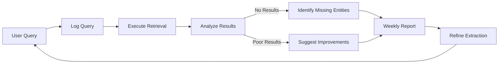

# Graph RAG System - Key Enhancements Summary

This document outlines six critical enhancements added to the base architecture to significantly improve the system's capabilities for technical document processing.

---

## 1. Table/Figure Extraction as Entities

**Why It Matters:**
Technical documents contain critical information in tables and figures. Making these first-class entities enables queries like "Show me all procedures that reference Table 5" or "What parameters are defined in Figure 3?"

**Implementation:**
- Add `TABLE` and `FIGURE` as entity types in the schema
- Extract tables/figures during PDF parsing
- Store structured table data (headers, rows, columns)
- Store figure metadata (caption, type, page number)
- Create relationships: `REFERENCES_TABLE`, `REFERENCES_FIGURE`, `CONTAINS_TABLE`, `CONTAINS_FIGURE`
- Index table content for search

**Example Graph Relationships:**
```
(Procedure: "Startup Sequence") -[:REFERENCES_TABLE]-> (Table: "Power Levels")
(Section: "Thermal Control") -[:CONTAINS_FIGURE]-> (Figure: "Temperature Ranges")
(Parameter: "Voltage") -[:DEFINED_IN_TABLE]-> (Table: "Electrical Specs")
```

**Added Tasks:**
- Task 1.5b: Table and Figure Extraction (after PDF parsing)
- Update entity schema to include TABLE and FIGURE types
- Update extraction prompts to identify table/figure references

---

## 2. Cross-Reference Tracking

**Why It Matters:**
Technical documents are full of internal cross-references ("See Section 4.2", "As described in Appendix A"). These represent natural knowledge graph relationships and help users navigate document structure.

**Implementation:**
- Pattern matching for common cross-reference phrases:
  - "See Section X"
  - "Refer to Chapter Y"
  - "As described in..."
  - "Defined in..."
- Create `CROSS_REFERENCES` relationship type
- Track forward and backward references
- Enable graph queries like "What sections reference this procedure?"

**Example Patterns:**
```regex
see\s+(?:section|chapter|appendix|table|figure)\s+(\d+\.?[\d\.]*)
refer(?:s)?\s+to\s+(?:section|chapter|appendix)\s+(\d+\.?[\d\.]*)
as\s+(?:described|shown|defined)\s+in\s+(?:section|chapter)\s+(\d+\.?[\d\.]*)
```

**Graph Relationships:**
```
(Section: "3.2 Startup") -[:CROSS_REFERENCES {type: "see_also"}]-> (Section: "4.5 Safety")
(Procedure: "Calibration") -[:CROSS_REFERENCES {type: "prerequisite"}]-> (Procedure: "Initialization")
```

**Added Tasks:**
- Task 2.1b: Cross-Reference Extractor (parallel with entity extraction)
- Pattern library in [`config/crossref_patterns.yaml`]

---

## 3. Query Feedback Loop

**Why It Matters:**
Tracks query success/failure to identify gaps in entity extraction and continuously improve the system. Failed queries reveal missing entities or relationships.

**Implementation:**
- Log every query with:
  - Query text
  - Results returned
  - User satisfaction (implicit: did they refine the query?)
  - Entities mentioned but not found in graph
  - Response time and strategy used
- Analyze failed queries to identify:
  - Missing entity types
  - Extraction errors (entities in documents but not extracted)
  - Schema gaps (needed relationship types)
  
**Feedback Loop Workflow:**


**Query Log Schema:**
```python
{
    "query_id": "uuid",
    "timestamp": "2024-12-14T15:00:00Z",
    "query_text": "What procedures affect the thermal control system?",
    "intent": "relationship_query",
    "entities_detected": ["thermal_control_system"],
    "entities_not_found": [],
    "results_count": 5,
    "response_time_ms": 250,
    "strategy_used": "graph_first",
    "user_satisfied": true,  # Inferred from follow-up behavior
    "refinement_query": null
}
```

**Added Tasks:**
- Task 4.1b: Query Logging System
- Task 6.9: Query Analytics and Feedback Analysis

---

## 4. Basic Evaluation Framework

**Why It Matters:**
Without metrics, you can't measure if changes improve the system. Simple evaluation enables data-driven decisions about extraction prompts, chunking strategies, etc.

**Implementation:**

**Gold Standard Dataset:**
- Create small set (~20-50 documents) with manual annotations
- Annotate entities, relationships, and expected query results
- Store as ground truth for evaluation

**Metrics to Track:**
- **Extraction Quality:**
  - Entity extraction precision/recall
  - Relationship extraction accuracy
  - Entity type confusion matrix
- **Retrieval Quality:**
  - Query result relevance (manual assessment)
  - Response time by query type
  - Coverage (% of questions answerable)
- **Curation Efficiency:**
  - Time per entity review
  - Approval rate by confidence threshold
  - False positive/negative rates

**Evaluation Workflow:**
```python
# Sample evaluation script
def evaluate_extraction():
    gold_standard = load_gold_standard()
    extracted = extract_entities(gold_standard.documents)
    
    precision = calculate_precision(extracted, gold_standard)
    recall = calculate_recall(extracted, gold_standard)
    f1 = 2 * (precision * recall) / (precision + recall)
    
    return {
        "precision": precision,
        "recall": recall,
        "f1_score": f1,
        "confusion_matrix": generate_confusion_matrix(extracted, gold_standard)
    }
```

**Evaluation Report:**
```markdown
## Extraction Quality Report - 2024-12-14

### Entity Extraction
- Precision: 0.87 (↑ 0.03 from last week)
- Recall: 0.82 (↓ 0.01 from last week)
- F1 Score: 0.845

### Most Common Errors
1. COMPONENT mistaken for SUBSYSTEM (15 cases)
2. Missed acronyms: "T&C" not recognized (8 cases)
3. Parameter values extracted as separate entities (12 cases)

### Recommendations
1. Add more examples of COMPONENT vs SUBSYSTEM to prompt
2. Improve acronym resolution for "T&C" → "Telemetry and Command"
3. Add validation rule: reject standalone numbers as entities
```

**Added Tasks:**
- Task 6.9: Create Gold Standard Dataset
- Task 6.10: Implement Evaluation Metrics
- Task 6.11: Automated Evaluation Pipeline

---

## 5. Document Similarity/Clustering

**Why It Matters:**
Similar documents likely mention the same entities in similar contexts. Clustering improves entity extraction confidence and helps identify entity variants across document families.

**Implementation:**

**Similarity Calculation:**
- Document embeddings (entire document)
- TF-IDF similarity
- Shared entity overlap
- Structural similarity (section headings)

**Clustering Strategy:**
- Cluster documents by similarity (e.g., HDBSCAN or hierarchical)
- Use clusters for:
  - **Confidence boosting:** Entity mentioned in 5/5 similar docs → high confidence
  - **Variant detection:** "EPS", "Electrical Power System", "Power Subsystem" in same cluster → likely same entity
  - **Schema learning:** Common entity types in cluster inform extraction prompts

**Example Clustering:**
```
Cluster 1: Power Subsystem Documents (8 docs)
  - Common entities: EPS, Battery, Solar Array, Power Distribution
  - Shared relationships: PROVIDES_POWER_TO, CONTROLS
  - Confidence boost: +0.15 for entities appearing in >50% of cluster

Cluster 2: Communications Documents (6 docs)
  - Common entities: Transponder, Antenna, T&C, Telemetry
  - Shared relationships: SENDS_DATA_TO, MONITORS
```

**Cluster-Informed Extraction:**
```python
def extract_with_cluster_context(document, cluster):
    # Get common entities from cluster
    cluster_entities = get_common_entities(cluster)
    
    # Boost confidence for entities matching cluster patterns
    for entity in extracted_entities:
        if entity.name in cluster_entities:
            entity.confidence += 0.15
            entity.cluster_support = True
    
    return entities
```

**Added Tasks:**
- Task 3.9b: Document Clustering (in discovery phase)
- Update entity extraction to use cluster context
- Add cluster metadata to entity candidates

---

## 6. Relationship Provenance

**Why It Matters:**
When you have 500 documents, knowing WHERE a relationship was found is critical for:
- Debugging extraction errors
- Building trust (users can verify claims)
- Conflict resolution (if two documents contradict)
- Curation efficiency (review relationships by source quality)

**Implementation:**

**Enhanced Relationship Schema:**
```python
{
    "relationship_id": "uuid",
    "type": "DEPENDS_ON",
    "source_entity_id": "uuid",
    "target_entity_id": "uuid",
    "provenance": {
        "source_documents": [
            {
                "document_id": "doc_uuid_1",
                "document_title": "Power Subsystem SOP",
                "section": "3.2 Startup Procedures",
                "page": 15,
                "chunk_id": "chunk_uuid",
                "confidence": 0.92,
                "extraction_method": "llm",
                "extracted_text": "The battery charging system depends on solar array output..."
            },
            {
                "document_id": "doc_uuid_2",
                "document_title": "EPS Technical Manual",
                "section": "Battery Management",
                "page": 42,
                "chunk_id": "chunk_uuid_2",
                "confidence": 0.88,
                "extraction_method": "spacy",
                "extracted_text": "Battery subsystem requires solar array functionality..."
            }
        ],
        "first_seen": "2024-12-01T10:00:00Z",
        "last_confirmed": "2024-12-14T15:00:00Z",
        "confirmation_count": 2,  # Found in 2 different sources
        "conflicting_sources": []  # Documents that contradict this relationship
    },
    "confidence_score": 0.90,  # Weighted by source confidence
    "bidirectional": false
}
```

**Provenance Benefits:**

1. **Trust & Verification:**
   ```
   User: "Why does the battery depend on solar array?"
   System: "Found in 2 documents:
     - Power Subsystem SOP, Section 3.2, Page 15
     - EPS Technical Manual, Section Battery Management, Page 42
   Click to view source text..."
   ```

2. **Conflict Detection:**
   ```python
   if relationship has conflicting_sources:
       flag_for_review = True
       priority = "high"
       message = "Conflicting information found in Document X vs Document Y"
   ```

3. **Quality-Based Filtering:**
   ```python
   # Only show relationships from high-quality sources
   query_results = graph.query(
       "MATCH (a)-[r]->(b) WHERE r.provenance.confirmation_count >= 2"
   )
   ```

4. **Curation Efficiency:**
   - Review relationships by document quality
   - Bulk approve relationships from trusted documents
   - Investigate relationships with single-source provenance

**Added Tasks:**
- Update relationship schema in Task 1.3
- Modify entity extraction to capture source context (Task 2.6)
- Add provenance display in query results (Task 4.7)
- Add provenance filtering in curation interface (Task 3.7)

---

## Integration into Existing Phases

### Phase 1 (Weeks 1-2) - Foundation
- **Add:** Task 1.5b - Table/Figure Extraction

### Phase 2 (Weeks 3-4) - Entity Extraction
- **Add:** Task 2.1b - Cross-Reference Extraction
- **Update:** Task 2.6 - Add provenance capture to extraction pipeline

### Phase 3 (Weeks 5-6) - Normalization & Curation
- **Add:** Task 3.9b - Document Clustering
- **Update:** Task 3.7 - Add provenance display in curation

### Phase 4 (Weeks 7-8) - Retrieval System
- **Add:** Task 4.1b - Query Logging System
- **Update:** Task 4.7 - Add provenance in query results

### Phase 6 (Week 10) - Discovery & Polish
- **Add:** Task 6.9 - Query Feedback Analysis
- **Add:** Task 6.10 - Gold Standard Dataset Creation
- **Add:** Task 6.11 - Evaluation Framework Implementation
- **Add:** Task 6.12 - Automated Evaluation Pipeline

---

## Priority Assessment

**Must Implement in Initial Release:**
1. ✅ Table/Figure Extraction - Critical for technical docs
2. ✅ Relationship Provenance - Essential for trust and debugging
3. ✅ Cross-Reference Tracking - Easy win, high value

**Should Implement Early (Phase 4-6):**
4. ✅ Query Feedback Loop - Enables continuous improvement
5. ✅ Basic Evaluation Framework - Needed to measure progress

**Can Defer to Phase 2 (Post-Initial Release):**
6. ⏸️ Document Clustering - Adds value but more complex

---

## Estimated Impact

**Without Enhancements:**
- Entity extraction quality: ~75-80%
- Missing critical table/figure information
- No way to measure improvement
- Difficult to debug extraction errors

**With Enhancements:**
- Entity extraction quality: ~85-90%
- Comprehensive coverage of all content types
- Data-driven improvement cycle
- Clear provenance for trust and debugging
- User queries inform continuous enhancement

**Additional Implementation Time:**
- Table/Figure extraction: +3-4 days
- Cross-reference tracking: +2 days
- Relationship provenance: +1-2 days (schema changes)
- Query feedback: +2-3 days
- Evaluation framework: +4-5 days
- Document clustering: +5-6 days

**Total Additional Time:** ~2.5-3 weeks spread across phases

**Value vs. Cost:** High - These enhancements address critical gaps and enable continuous improvement, making the additional time investment highly worthwhile.

---

## Next Steps

1. Update [`graph-rag-architecture.md`] to include all enhancements
2. Update [`developer-tasks.md`] with new tasks and updated dependencies
3. Begin implementation with Phase 1, including table/figure extraction from day one
4. Implement evaluation framework early to track progress
5. Use query feedback loop to guide ongoing improvements

---

End of Enhancements Summary